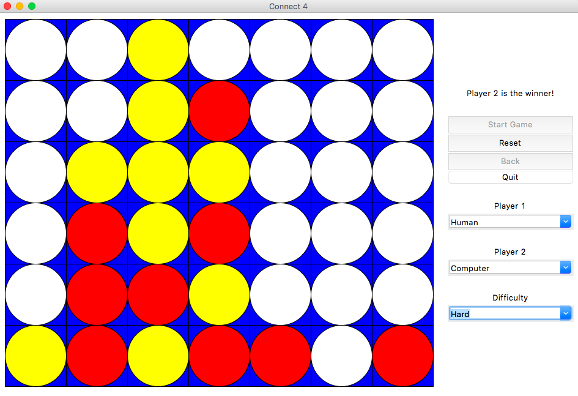

# Connect 4

This project is an implementation of Connect 4. It features a GUI that allows users to play against their friends or against the built-in bot. You can even pit the bot against itself (this will result in the same outcome every game).

## Features
- GUI was built using Tkinter
- Bot was built using Python3 and uses the [alpha-beta pruning algorithm](https://en.wikipedia.org/wiki/Alpha%E2%80%93beta_pruning)
    - Comes with two difficulty levels: Easy and Hard
        - Easy looks 3 turns ahead.
        - Hard looks 4 turns ahead.
        
    - Uses a heuristic that determines the state of the board by the number of 4-in-a-rows a player could make
- Allows user to play against another human through a selection menu
- Comes with a back button to undo the previous turn (and the turns before that)

## Run
1. To run this project, either clone this repo or download a zip file (and uncompress) of it.
2. Open your terminal and change your directory to this folder.
3. Ensure that you have python installed and run `python main.py`
